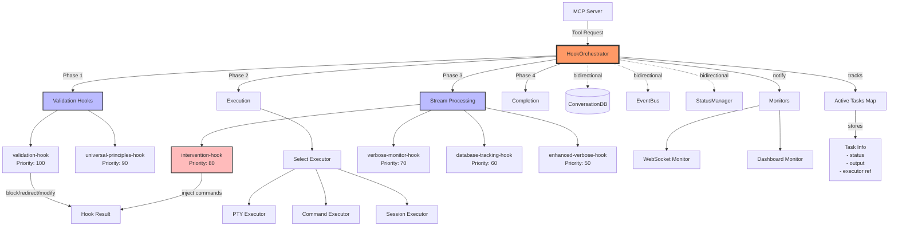

# Hooks Architecture in Claude Code v4

## Overview

Claude Code v4 implements a **hook-first architecture** where all execution flows through a central `HookOrchestrator`. This design enables real-time monitoring, intervention, and modification of execution behavior without modifying core logic.

## Architecture Diagram



## Hook Lifecycle

### 1. **Request Phase**
```typescript
REQUEST_RECEIVED → REQUEST_VALIDATED → REQUEST_BLOCKED (if rejected)
```

### 2. **Execution Phase**
```typescript
EXECUTION_STARTED → EXECUTION_STREAM → EXECUTION_INTERVENTION → EXECUTION_COMPLETED/FAILED
```

### 3. **Monitoring Phase**
```typescript
MONITOR_ATTACH → MONITOR_DETACH
```

### 4. **Parallel Execution**
```typescript
PARALLEL_SPAWN → PARALLEL_MERGE
```

## Hook Components

### Hook Definition
```typescript
export interface Hook {
  name: string;              // Unique identifier
  events: HookEvent[];       // Events to listen for
  priority: number;          // Higher = runs first
  handler: HookHandler;      // Async function
}
```

### Hook Context
```typescript
export interface HookContext {
  event: HookEvent;          // Current event
  request?: {                // Tool request data
    tool: string;
    args: any;
  };
  execution?: {              // Execution state
    taskId: string;
    status: string;
    output?: string;
  };
  stream?: {                 // Stream data
    data: string;
    source: string;
  };
  metadata?: Record<string, any>;
  // Core component access
  db?: ConversationDB;
  eventBus?: EventBus;
  statusManager?: StatusManager;
}
```

### Hook Result
```typescript
export interface HookResult {
  action: 'continue' | 'block' | 'modify' | 'redirect';
  reason?: string;
  modifications?: any;
  redirect?: {
    tool: string;
    args: any;
  };
}
```

## Built-in Hooks

### 1. **Validation Hook** (Priority: 100)
- **Events**: `REQUEST_RECEIVED`
- **Purpose**: Ensures concrete deliverables
- **Actions**: 
  - Blocks requests without action verbs
  - Redirects research to implementation
  - Validates deliverable specifications

### 2. **Universal Principles Hook** (Priority: 90)
- **Events**: `REQUEST_RECEIVED`, `EXECUTION_STREAM`
- **Purpose**: Enforces coding principles
- **Principles**:
  - No mocks ever
  - No TODOs
  - Action over planning
  - Verify don't trust
  - Fail fast and loudly

### 3. **Intervention Hook** (Priority: 80)
- **Events**: `EXECUTION_STREAM`
- **Purpose**: Real-time pattern detection and correction
- **Interventions**:
  - TODO detection → Forces implementation
  - Error patterns → Injects fixes
  - Hanging processes → Sends Ctrl+C
  - Claude --print detection → Immediate block

### 4. **Database Tracking Hook** (Priority: 60)
- **Events**: All lifecycle events
- **Purpose**: Persists execution history
- **Tracks**:
  - Conversations
  - Actions
  - Streams
  - Interventions

### 5. **Verbose Monitor Hook** (Priority: 70)
- **Events**: `EXECUTION_STREAM`
- **Purpose**: Real-time output display
- **Features**:
  - Progress bars
  - Task prefixes
  - Intervention highlighting

## Execution Flow

### 1. **Tool Request Entry**
```typescript
MCP Server → orchestrator.handleRequest(tool, args)
```

### 2. **Validation Phase**
```typescript
// All validation hooks run in priority order
const validationResult = await triggerHooks(REQUEST_RECEIVED, context);

if (validationResult.action === 'block') {
  throw new Error(validationResult.reason);
}

if (validationResult.action === 'redirect') {
  return handleRequest(redirect.tool, redirect.args);
}
```

### 3. **Executor Selection**
```typescript
const executor = await selectExecutor(tool, args);
// Hooks can override executor selection
```

### 4. **Stream Processing**
```typescript
executor.onData(async (data) => {
  const streamResult = await triggerHooks(EXECUTION_STREAM, {
    stream: { data, source: taskId }
  });
  
  if (streamResult.action === 'modify') {
    executor.injectCommand(streamResult.modifications.command);
  }
});
```

### 5. **Non-blocking Verbose Mode**
```typescript
if (args.verboseMasterMode) {
  // Start execution without awaiting
  executionPromise.then(handleCompletion).catch(handleError);
  
  // Return immediately
  return { taskId, status: 'executing', message: '...' };
}
```

## Key Features

### 1. **Real-time Intervention**
- Hooks monitor output character-by-character
- Pattern detection triggers immediate interventions
- Commands injected directly into running processes

### 2. **Task Management**
- Active tasks tracked in memory
- Each task has executor reference for communication
- Non-blocking execution for verbose mode

### 3. **Bidirectional Communication**
- Components can trigger hooks
- Hooks can access core components
- EventBus enables cross-component messaging

### 4. **Priority-based Execution**
- Hooks run in priority order (higher first)
- First blocking hook wins
- Modifications accumulate from all hooks

### 5. **Pattern-based Interventions**
```typescript
const interventions = new Map([
  [/\bTODO\b/i, 'echo "# WARNING: TODO detected - implement now"'],
  [/claude --print/i, '\x03'], // Immediate interrupt
  [/npm ERR!/i, 'npm install'],
]);
```

## Extension Points

### Adding a New Hook
```typescript
// 1. Define the hook
export const myHook: Hook = {
  name: 'my-hook',
  events: [HookEvent.EXECUTION_STREAM],
  priority: 75,
  handler: async (context) => {
    // Hook logic
    return { action: 'continue' };
  }
};

// 2. Register in index.ts
orchestrator.registerHook(myHook);
```

### Adding a New Executor
```typescript
// 1. Create executor class
class MyExecutor {
  async execute(args, streamHandler) {
    // Execution logic
  }
}

// 2. Register with orchestrator
orchestrator.registerExecutor('my_tool', new MyExecutor());
```

## Critical Design Decisions

1. **Hook-First**: All execution flows through hooks - no bypassing
2. **Priority System**: Ensures predictable hook execution order
3. **Non-blocking Verbose**: Enables real-time monitoring without blocking
4. **Pattern Detection**: Character-level analysis for immediate intervention
5. **Component Access**: Hooks have full access to core components
6. **Task Tracking**: Active tasks maintained for communication/status

This architecture enables Claude Code v4 to monitor, intervene, and modify execution behavior in real-time while maintaining clean separation of concerns through the hook system.