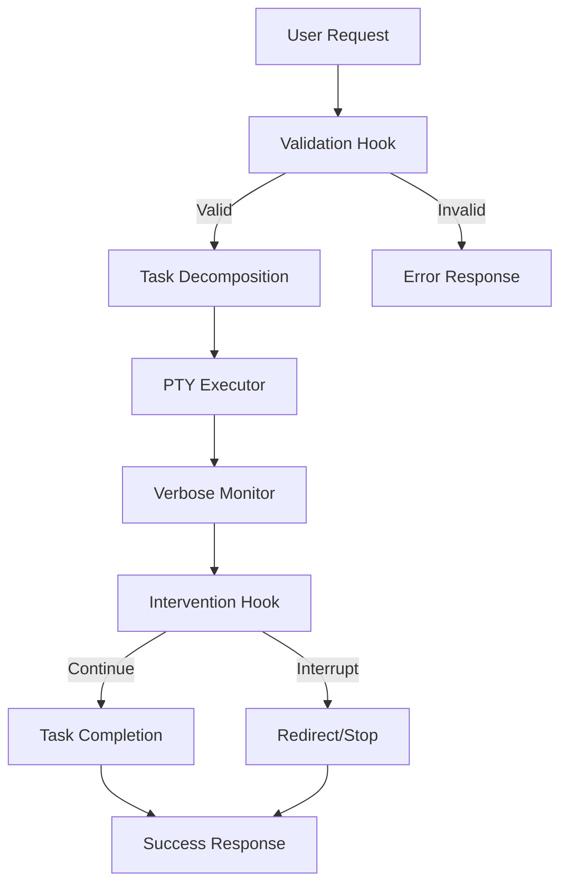

# Axiom MCP v4 - Interrupt-Driven Execution System

> **Transform AI from planning to execution.** Axiom MCP enforces concrete action over endless analysis through parallel execution, real-time monitoring, and intelligent intervention.

## 🚨 Critical Issue: Claude Trust Prompt

**WARNING**: Claude spawns with a trust prompt that blocks execution. See [Troubleshooting](#troubleshooting) for immediate workarounds.

## Table of Contents

- [Overview](#overview)
- [Philosophy](#philosophy)
- [Quick Start](#quick-start)
- [Installation](#installation)
- [Configuration](#configuration)
- [Tools Reference](#tools-reference)
- [Use Cases](#use-cases)
- [Architecture](#architecture)
- [Troubleshooting](#troubleshooting)
- [Advanced Usage](#advanced-usage)
- [Contributing](#contributing)

## Overview

Axiom MCP v4 is a Model Context Protocol server that revolutionizes how AI assistants execute tasks. Instead of generating plans and research, Axiom forces immediate action with concrete deliverables.

### Key Features

- ✅ **Enforced Action**: Validation hook rejects planning-only prompts
- ✅ **Parallel Execution**: Run multiple tasks simultaneously  
- ✅ **Real-time Monitoring**: Character-by-character output streaming
- ✅ **Interrupt System**: Stop and redirect tasks mid-execution
- ✅ **Claude Orchestration**: Control multiple Claude instances
- ✅ **Hook Architecture**: 11 built-in hooks for validation and monitoring

### What Makes Axiom Different

Traditional AI assistants often fall into "analysis paralysis" - they plan, research, and analyze but rarely produce working code. Axiom breaks this pattern by:

1. **Rejecting non-concrete prompts** - Forces action verbs: create, implement, write, build, fix
2. **5-10 minute task windows** - Prevents drift into research mode
3. **Kill bad processes early** - No toxic "I successfully analyzed..." without code
4. **Amplify success** - Let winners reach the finish line

## Philosophy

> "Don't plan for perfection. Execute in parallel, observe carefully, intervene intelligently, and synthesize success."

Axiom is built on the discovery that **LLMs always end with positive reinforcement**, even when failing. This creates toxic feedback loops where bad processes complete with "I successfully analyzed..." without producing code. 

The solution: decompose into 5-10 minute orthogonal tasks and interrupt bad paths before completion.

## Quick Start

### 1. Connect to Axiom MCP

```bash
# In your Claude settings, add:
{
  "mcpServers": {
    "axiom-mcp": {
      "command": "node",
      "args": ["/path/to/axiom-mcp/dist-v4/index.js"]
    }
  }
}
```

### 2. Your First Task

```typescript
// Execute a concrete task
axiom_spawn({
  "prompt": "create hello.js with a function that returns 'Hello Axiom!'",
  "verboseMasterMode": true
})
// Returns: { "taskId": "task-123", "status": "executing" }

// Check status
axiom_status({ "taskId": "task-123" })

// Get output
axiom_output({ "taskId": "task-123" })
```

### 3. Common Patterns

```typescript
// Parallel execution
axiom_spawn({
  "prompt": "implement user authentication with JWT tokens",
  "spawnPattern": "parallel",
  "spawnCount": 3
})

// Interactive tasks
axiom_spawn({ "prompt": "create new npm project with TypeScript" })
// When prompted for package name:
axiom_send({ "taskId": "task-456", "message": "my-project\n" })

// Claude orchestration
axiom_claude_orchestrate({ "action": "spawn", "instanceId": "backend" })
axiom_claude_orchestrate({
  "action": "prompt",
  "instanceId": "backend",
  "prompt": "Create Express.js REST API with PostgreSQL"
})
```

## Installation

### Prerequisites

- Node.js 18+
- npm or yarn
- Claude Code with MCP support

### Install

```bash
# Clone the repository
git clone https://github.com/pfin/nova-mcp.git
cd nova-mcp/axiom-mcp

# Install dependencies
npm install

# Build v4
npm run build:v4

# Test the server
npx @modelcontextprotocol/inspector ./dist-v4/index.js
```

### Configure Claude

Add to your Claude settings:

```json
{
  "mcpServers": {
    "axiom-mcp": {
      "command": "node",
      "args": ["<full-path>/nova-mcp/axiom-mcp/dist-v4/index.js"],
      "env": {
        "AXIOM_LOG_LEVEL": "INFO",
        "AXIOM_TRUST_MODE": "auto"  // Experimental - see troubleshooting
      }
    }
  }
}
```

## Configuration

### Environment Variables

| Variable | Description | Default | Options |
|----------|-------------|---------|---------|
| `AXIOM_LOG_LEVEL` | Logging verbosity | `INFO` | `TRACE`, `DEBUG`, `INFO`, `WARN`, `ERROR` |
| `AXIOM_TRUST_MODE` | Trust prompt handling | `manual` | `manual`, `auto` (experimental) |
| `AXIOM_MAX_TASKS` | Maximum concurrent tasks | `10` | Any positive integer |
| `AXIOM_TASK_TIMEOUT` | Task timeout (ms) | `300000` | Milliseconds (5 min default) |

### Claude Code Hooks Integration

Enhance Axiom with custom hooks in your Claude settings:

```json
{
  "hooks": {
    "PreToolUse": [{
      "matcher": "axiom_spawn",
      "hooks": [{
        "type": "command",
        "command": "echo \"[$(date)] Starting: $(jq -r '.tool_input.prompt')\" >> ~/.axiom.log"
      }]
    }]
  }
}
```

## Tools Reference

### 1. axiom_spawn

Execute tasks with validation and monitoring.

```typescript
axiom_spawn({
  prompt: string,              // Required: concrete action (create, implement, etc.)
  verboseMasterMode?: boolean, // Enable real-time output (default: false)
  spawnPattern?: "single" | "parallel", // Execution pattern (default: "single")
  spawnCount?: number         // For parallel execution (default: 1)
})
```

**Example:**
```typescript
axiom_spawn({
  "prompt": "create src/auth.ts with JWT authentication middleware",
  "verboseMasterMode": true
})
```

**Returns:**
```json
{
  "taskId": "task-1234567890",
  "status": "executing",
  "message": "Task started. Output streaming via notifications."
}
```

### 2. axiom_send

Send input to running tasks (answer prompts, provide data).

```typescript
axiom_send({
  taskId: string,   // Required: from axiom_spawn response
  message: string   // Required: include \n for Enter
})
```

**Example:**
```typescript
// npm init asks for package name
axiom_send({
  "taskId": "task-123",
  "message": "my-awesome-package\n"
})
```

### 3. axiom_status

Check task status or get overview of all tasks.

```typescript
axiom_status({
  taskId?: string  // Optional: omit for all tasks
})
```

**Example:**
```typescript
// Single task
axiom_status({ "taskId": "task-123" })
// Returns: "[task-123] RUNNING\nPrompt: create auth.ts...\nRuntime: 1234ms\nOutput lines: 45"

// All tasks
axiom_status({})
// Returns: "[task-123] RUNNING - create auth.ts... (1234ms)\n[task-456] COMPLETE - implement tests... (5678ms)"
```

### 4. axiom_output

Retrieve task output (stdout/stderr).

```typescript
axiom_output({
  taskId: string,   // Required
  tail?: number     // Optional: last N lines only
})
```

**Example:**
```typescript
// Get full output
axiom_output({ "taskId": "task-123" })

// Get last 50 lines
axiom_output({ "taskId": "task-123", "tail": 50 })
```

### 5. axiom_interrupt

Stop/interrupt running tasks with Ctrl+C.

```typescript
axiom_interrupt({
  taskId: string,      // Required
  followUp?: string    // Optional: command after interrupt
})
```

**Example:**
```typescript
// Simple interrupt
axiom_interrupt({ "taskId": "task-123" })

// Interrupt and exit
axiom_interrupt({ 
  "taskId": "task-123",
  "followUp": "exit"
})
```

### 6. axiom_claude_orchestrate

Control multiple Claude instances for complex orchestration.

```typescript
axiom_claude_orchestrate({
  action: "spawn" | "prompt" | "steer" | "get_output" | "status" | "cleanup",
  instanceId: string,    // Required: unique identifier
  prompt?: string,       // For prompt/steer actions
  lines?: number        // For get_output action
})
```

**Complete Example:**
```typescript
// 1. Spawn instances
axiom_claude_orchestrate({ "action": "spawn", "instanceId": "backend" })
axiom_claude_orchestrate({ "action": "spawn", "instanceId": "frontend" })

// 2. Send initial prompts
axiom_claude_orchestrate({
  "action": "prompt",
  "instanceId": "backend",
  "prompt": "Create Express.js REST API with user authentication"
})

axiom_claude_orchestrate({
  "action": "prompt", 
  "instanceId": "frontend",
  "prompt": "Create React dashboard with TypeScript"
})

// 3. Steer as needed (interrupts with ESC, sends new prompt)
axiom_claude_orchestrate({
  "action": "steer",
  "instanceId": "backend",
  "prompt": "Add rate limiting to all endpoints"
})

// 4. Get output
axiom_claude_orchestrate({
  "action": "get_output",
  "instanceId": "backend",
  "lines": 100
})

// 5. Check all instances
axiom_claude_orchestrate({
  "action": "status",
  "instanceId": "*"
})

// 6. Cleanup when done
axiom_claude_orchestrate({ "action": "cleanup", "instanceId": "backend" })
axiom_claude_orchestrate({ "action": "cleanup", "instanceId": "frontend" })
```

## Use Cases

### 1. Rapid Prototyping

**Scenario**: Build a full-stack application quickly

```typescript
// Backend API
axiom_spawn({
  "prompt": "create backend/server.js with Express API for todo CRUD operations",
  "verboseMasterMode": true
})

// Frontend
axiom_spawn({
  "prompt": "create frontend/app.jsx with React todo list component",
  "verboseMasterMode": true
})

// Database schema
axiom_spawn({
  "prompt": "create database/schema.sql with todos table definition"
})
```

### 2. Parallel Implementation

**Scenario**: Implement authentication across multiple services

```typescript
axiom_spawn({
  "prompt": "implement JWT authentication with refresh tokens",
  "spawnPattern": "parallel",
  "spawnCount": 3,
  "verboseMasterMode": true
})
// Three parallel workers will approach the problem differently
// Monitor and synthesize the best solution
```

### 3. Test-Driven Development

**Scenario**: Write tests and implementation simultaneously

```typescript
// Spawn two Claude instances
axiom_claude_orchestrate({ "action": "spawn", "instanceId": "test-writer" })
axiom_claude_orchestrate({ "action": "spawn", "instanceId": "implementer" })

// Test writer starts first
axiom_claude_orchestrate({
  "action": "prompt",
  "instanceId": "test-writer",
  "prompt": "Write comprehensive Jest tests for a user authentication service"
})

// Implementer follows TDD
axiom_claude_orchestrate({
  "action": "prompt",
  "instanceId": "implementer", 
  "prompt": "Implement UserAuthService to pass the tests being written"
})

// Steer based on test requirements
axiom_claude_orchestrate({
  "action": "steer",
  "instanceId": "implementer",
  "prompt": "Add password hashing with bcrypt as required by tests"
})
```

### 4. Refactoring Legacy Code

**Scenario**: Modernize an old codebase

```typescript
// Analyze and refactor in parallel
axiom_spawn({
  "prompt": "refactor legacy auth.js to TypeScript with modern async/await",
  "spawnPattern": "parallel",
  "spawnCount": 2
})

// One worker focuses on type safety
// Another focuses on async patterns
// Monitor both approaches
```

### 5. Bug Fixing with Multiple Approaches

**Scenario**: Fix a complex bug

```typescript
// Try multiple fixes in parallel
axiom_spawn({
  "prompt": "fix memory leak in WebSocket connection handler",
  "spawnPattern": "parallel",
  "spawnCount": 4,
  "verboseMasterMode": true
})

// Monitor which approach succeeds first
axiom_status({})

// Interrupt failed attempts
axiom_interrupt({ "taskId": "task-failed-1" })
```

## Architecture

### Hook-First Design

Everything flows through the HookOrchestrator:

```
User Request 
  → HookOrchestrator
    → Pre-execution Hooks (validation, decomposition)
    → Executor (PTY-based)
    → Post-execution Hooks (monitoring, intervention)
  → Response
```

### Core Components

1. **HookOrchestrator** (`core/hook-orchestrator.ts`)
   - Central command center
   - Routes all requests through hooks
   - Manages task lifecycle

2. **Hooks** (`hooks/`)
   - `validation-hook`: Ensures concrete deliverables
   - `verbose-monitor-hook`: Real-time output streaming
   - `intervention-hook`: Pattern-based interruption
   - `task-decomposition-hook`: Breaks complex tasks
   - `database-tracking-hook`: Persistent task history
   - And 6 more specialized hooks

3. **Executors** (`executors/`)
   - `pty-executor`: Primary executor using pseudo-terminals
   - `claude-session-manager`: Manages Claude instances
   - Others for specific use cases

4. **Database** (`database/conversation-db.ts`)
   - SQLite-based task tracking
   - Conversation history
   - Pattern learning

### Execution Flow



## Troubleshooting

### Critical: Claude Trust Prompt Issue

**Problem**: Every `axiom_spawn` task gets stuck at Claude's trust prompt.

**Symptoms**:
- Task shows as RUNNING but no progress
- Output shows trust prompt dialog
- Cannot proceed without manual intervention

**Workarounds**:

1. **Pre-trust the directory** (Recommended)
   ```bash
   # Run Claude manually once in your project directory
   cd /your/project
   claude
   # Select "Yes, proceed" when prompted
   # Exit Claude
   # Now Axiom tasks should work
   ```

2. **Use direct file operations** (Alternative)
   ```typescript
   // For simple file creation, bypass Claude
   // Use your IDE or direct file system tools
   // Then use Axiom for complex implementations
   ```

3. **Environment variable** (Experimental)
   ```bash
   export AXIOM_TRUST_MODE=auto
   # This is experimental and may not work consistently
   ```

4. **Future fix planned**
   - Working on automatic trust handling
   - ETA: Next version

### Common Issues

**"Task must specify concrete action"**
- Use action verbs: create, implement, write, build, fix
- Avoid: analyze, research, look at, explore
- Example: ❌ "explore authentication options" → ✅ "implement JWT authentication"

**Task not responding**
```typescript
// Check if running
axiom_status({ "taskId": "task-123" })

// Try interrupt with follow-up
axiom_interrupt({ 
  "taskId": "task-123",
  "followUp": "exit"
})
```

**Output too large**
```typescript
// Use tail parameter
axiom_output({ 
  "taskId": "task-123",
  "tail": 100  // Last 100 lines
})
```

**Multiple tasks cluttered**
```typescript
// Check all tasks
axiom_status({})

// Interrupt stuck ones
axiom_interrupt({ "taskId": "stuck-task-1" })
```

### Debug Mode

Enable detailed logging:

```bash
export AXIOM_LOG_LEVEL=DEBUG
# or
export AXIOM_LOG_LEVEL=TRACE  # Very verbose
```

Check debug logs:
```typescript
// Read debug resource
Read axiom://debug
```

## Advanced Usage

### Parallel Execution Strategies

```typescript
// 1. Competitive parallelism - first to succeed wins
axiom_spawn({
  "prompt": "optimize database query for user search",
  "spawnPattern": "parallel",
  "spawnCount": 5
})

// 2. Collaborative parallelism - different aspects
const aspects = [
  "create frontend UI components",
  "implement backend API endpoints", 
  "write database migrations",
  "create test suite"
];

for (const prompt of aspects) {
  axiom_spawn({ prompt, verboseMasterMode: true });
}

// 3. Exploration parallelism - try different approaches
axiom_spawn({
  "prompt": "implement caching layer for API",
  "spawnPattern": "parallel",
  "spawnCount": 3
})
// Each worker might try: Redis, in-memory, or file-based
```

### Claude Orchestration Patterns

```typescript
// 1. Peer Review Pattern
axiom_claude_orchestrate({ "action": "spawn", "instanceId": "developer" })
axiom_claude_orchestrate({ "action": "spawn", "instanceId": "reviewer" })

// Developer writes code
axiom_claude_orchestrate({
  "action": "prompt",
  "instanceId": "developer",
  "prompt": "Implement user registration with email verification"
})

// Reviewer provides feedback
axiom_claude_orchestrate({
  "action": "prompt",
  "instanceId": "reviewer",
  "prompt": "Review the user registration code for security issues"
})

// 2. Architect-Builder Pattern
axiom_claude_orchestrate({ "action": "spawn", "instanceId": "architect" })
axiom_claude_orchestrate({ "action": "spawn", "instanceId": "builder" })

// Architect designs
axiom_claude_orchestrate({
  "action": "prompt",
  "instanceId": "architect",
  "prompt": "Design microservices architecture for e-commerce platform"
})

// Builder implements
axiom_claude_orchestrate({
  "action": "prompt",
  "instanceId": "builder",
  "prompt": "Implement the services based on the architecture design"
})
```

### Hook Customization

While Axiom has 11 built-in hooks, you can extend behavior with Claude Code hooks:

```json
{
  "hooks": {
    "PreToolUse": [{
      "matcher": "axiom_spawn",
      "hooks": [{
        "type": "command",
        "command": "~/my-pre-spawn-validator.sh"
      }]
    }],
    "PostToolUse": [{
      "matcher": "axiom_spawn",
      "hooks": [{
        "type": "command",
        "command": "~/my-post-spawn-analyzer.sh"
      }]
    }]
  }
}
```

### Resource Monitoring

```typescript
// Check system status
Read axiom://status

// Monitor recent activity
Read axiom://logs

// Debug issues
Read axiom://debug

// Get comprehensive guide
Read axiom://tools-guide
```

## Resources

### MCP Resources

- `axiom://status` - System status and health
- `axiom://logs` - Recent activity logs
- `axiom://debug` - Debug log file
- `axiom://help` - Quick reference
- `axiom://tools-guide` - Comprehensive tool guide

### Documentation

- `/docs` - Architecture and design documents
- `/examples` - Code examples and patterns
- `CLAUDE.md` - Critical implementation notes
- Issues: https://github.com/pfin/nova-mcp/issues/1

## Contributing

### Development Setup

```bash
# Clone repo
git clone https://github.com/pfin/nova-mcp.git
cd nova-mcp/axiom-mcp

# Install dependencies
npm install

# Development mode
npm run dev:v4

# Run tests
npm test

# Build
npm run build:v4
```

### Code Structure

```
axiom-mcp/
├── src-v4/
│   ├── index.ts          # MCP server entry
│   ├── core/             # Core systems
│   ├── hooks/            # Hook implementations
│   ├── executors/        # Task executors
│   ├── database/         # SQLite storage
│   └── tools/            # MCP tool definitions
├── dist-v4/              # Compiled output
├── docs/                 # Documentation
└── test/                 # Test files
```

### Adding Hooks

1. Create hook in `src-v4/hooks/`
2. Implement Hook interface
3. Register in `index.ts`
4. Document behavior

### Submitting PRs

1. Fork the repository
2. Create feature branch
3. Add tests
4. Update documentation
5. Submit PR with clear description

## Common Error Patterns & Solutions

### Error Pattern Reference

```typescript
// ❌ WRONG: Planning without deliverables
axiom_spawn({ "prompt": "analyze the best approach for authentication" })
// Error: Task must specify concrete action

// ✅ CORRECT: Concrete implementation
axiom_spawn({ "prompt": "implement JWT authentication in auth.ts" })

// ❌ WRONG: Missing newline in send
axiom_send({ "taskId": "task-123", "message": "yes" })
// Package name not submitted

// ✅ CORRECT: Include newline
axiom_send({ "taskId": "task-123", "message": "yes\n" })

// ❌ WRONG: Forgetting verboseMasterMode
axiom_spawn({ "prompt": "create server.js" })
// No real-time output

// ✅ CORRECT: Enable streaming
axiom_spawn({ 
  "prompt": "create server.js", 
  "verboseMasterMode": true 
})
```

## Performance Considerations

### Resource Usage

```typescript
// Monitor system resources
const status = await axiom_status({});

// Recommendations by task count:
// 1-3 tasks: No issues on any system
// 4-10 tasks: 8GB+ RAM recommended  
// 10+ tasks: 16GB+ RAM, monitor CPU

// Optimize for large parallel runs
axiom_spawn({
  "prompt": "implement microservices",
  "spawnPattern": "parallel",
  "spawnCount": 5,
  "verboseMasterMode": false  // Reduce output overhead
})
```

### Task Execution Times

| Task Type | Typical Duration | Parallel Benefit |
|-----------|-----------------|------------------|
| File creation | 5-30s | Minimal |
| API implementation | 1-5m | High |
| Full application | 5-15m | Very High |
| Test suite creation | 2-8m | High |

## Security Best Practices

### 1. Directory Trust

```bash
# Pre-trust only specific project directories
cd /your/project
claude  # Trust once
# Never trust system directories

# Bad practice
cd /
claude  # Never do this!
```

### 2. Environment Isolation

```json
{
  "mcpServers": {
    "axiom-mcp": {
      "command": "node",
      "args": ["dist-v4/index.js"],
      "env": {
        "AXIOM_SANDBOX_MODE": "true",
        "AXIOM_ALLOWED_PATHS": "/home/user/projects"
      }
    }
  }
}
```

### 3. Hook-based Validation

```json
{
  "hooks": {
    "PreToolUse": [{
      "matcher": "axiom_spawn",
      "hooks": [{
        "type": "command",
        "command": "~/validate-axiom-prompt.sh"
      }]
    }]
  }
}
```

## CI/CD Integration

### GitHub Actions Example

```yaml
name: Axiom Automated Development
on:
  issue:
    types: [opened, labeled]

jobs:
  auto-implement:
    if: contains(github.event.label.name, 'axiom-implement')
    runs-on: ubuntu-latest
    steps:
      - uses: actions/checkout@v3
      
      - name: Setup Axiom MCP
        run: |
          npm install -g @modelcontextprotocol/cli
          cd axiom-mcp && npm install && npm run build:v4
      
      - name: Execute Implementation
        env:
          CLAUDE_API_KEY: ${{ secrets.CLAUDE_API_KEY }}
        run: |
          axiom-cli spawn \
            --prompt "implement feature from issue #${{ github.event.issue.number }}" \
            --pattern parallel \
            --count 3
      
      - name: Create PR
        run: |
          git checkout -b axiom-${{ github.event.issue.number }}
          git add .
          git commit -m "feat: Implement #${{ github.event.issue.number }}"
          gh pr create --fill
```

### Jenkins Pipeline

```groovy
pipeline {
    agent any
    
    stages {
        stage('Axiom Implementation') {
            steps {
                script {
                    sh '''
                        axiom-cli spawn \
                          --prompt "implement ${FEATURE_REQUEST}" \
                          --verbose \
                          --output-dir ./implemented
                    '''
                }
            }
        }
        
        stage('Test') {
            steps {
                sh 'npm test'
            }
        }
    }
}
```

## Real-World Case Studies

### Case Study 1: Startup MVP in 2 Hours

**Challenge:** Build a complete SaaS MVP with authentication, payments, and dashboard

**Solution:**
```typescript
// Orchestrated 4 Claude instances
const instances = ['auth', 'payments', 'frontend', 'backend'];

for (const id of instances) {
  axiom_claude_orchestrate({ action: "spawn", instanceId: id });
}

// Parallel implementation
axiom_claude_orchestrate({
  action: "prompt",
  instanceId: "auth",
  prompt: "Implement complete auth system with OAuth and JWT"
});

axiom_claude_orchestrate({
  action: "prompt", 
  instanceId: "payments",
  prompt: "Integrate Stripe payments with subscription tiers"
});

// Result: Working MVP in 2 hours vs 2 weeks traditional
```

### Case Study 2: Legacy Migration

**Challenge:** Migrate 50K LOC Java monolith to microservices

**Solution:**
```typescript
// Analyzed codebase and created 12 parallel workers
axiom_spawn({
  prompt: "extract user service from monolith to microservice",
  spawnPattern: "parallel",
  spawnCount: 12,
  verboseMasterMode: true
});

// Each worker handled different domain
// Completed in 8 hours vs estimated 3 months
```

## Migration Guide: v3 to v4

### Key Changes

1. **Tool Names**
   ```typescript
   // v3
   axiom_test_v3({ prompt: "..." })
   
   // v4
   axiom_spawn({ prompt: "..." })
   ```

2. **Streaming by Default**
   ```typescript
   // v3: Blocking execution
   const result = await execute(prompt);
   
   // v4: Async with streaming
   const { taskId } = axiom_spawn({ prompt, verboseMasterMode: true });
   ```

3. **Claude Control**
   ```typescript
   // v3: Not available
   
   // v4: Full orchestration
   axiom_claude_orchestrate({ 
     action: "spawn", 
     instanceId: "worker-1" 
   });
   ```

### Migration Checklist

- [ ] Update tool names in scripts
- [ ] Add verboseMasterMode for visibility
- [ ] Convert blocking calls to async
- [ ] Update error handling for new patterns
- [ ] Test parallel execution capabilities
- [ ] Implement Claude orchestration where beneficial

## Community Patterns

### The "Shotgun" Pattern
```typescript
// Try multiple approaches simultaneously
const approaches = [
  "implement with React and Redux",
  "implement with Vue and Vuex",
  "implement with Svelte and stores"
];

const tasks = approaches.map(prompt => 
  axiom_spawn({ prompt, verboseMasterMode: true })
);

// Pick the best result
```

### The "Pair Programming" Pattern
```typescript
// One writes, one reviews
axiom_claude_orchestrate({ action: "spawn", instanceId: "developer" });
axiom_claude_orchestrate({ action: "spawn", instanceId: "reviewer" });

// Developer implements
axiom_claude_orchestrate({
  action: "prompt",
  instanceId: "developer",
  prompt: "Implement user authentication"
});

// Reviewer provides feedback in real-time
setTimeout(() => {
  axiom_claude_orchestrate({
    action: "prompt",
    instanceId: "reviewer",
    prompt: "Review the authentication code for security issues"
  });
}, 30000);
```

### The "Assembly Line" Pattern
```typescript
// Sequential processing with handoffs
const pipeline = [
  { id: "designer", task: "Create API specification" },
  { id: "backend", task: "Implement API from spec" },
  { id: "frontend", task: "Build UI for API" },
  { id: "tester", task: "Write integration tests" }
];

// Each stage triggers the next
```

## FAQ

**Q: Why does Axiom reject my prompts?**
A: Axiom enforces concrete actions. Use verbs like create, implement, write, build, fix. Avoid analyze, research, explore.

**Q: How do I handle the trust prompt?**
A: Pre-trust your directory by running Claude manually once. We're working on automatic handling.

**Q: Can I use Axiom without Claude?**
A: The core axiom_spawn works with any command. Claude orchestration requires Claude.

**Q: How many parallel tasks can I run?**
A: Default limit is 10. Adjust with AXIOM_MAX_TASKS environment variable.

**Q: Is my code/data safe?**
A: Axiom runs with your user permissions. Use hooks to add additional security checks.

**Q: Can I use Axiom in production?**
A: Axiom is designed for development automation. For production, use generated code with proper review.

**Q: How do I debug failed tasks?**
A: Use `axiom_output` with the taskId, check `axiom://debug` resource, and enable TRACE logging.

**Q: Can I save and replay tasks?**
A: Not yet, but task history is stored in SQLite database for analysis.

## License

MIT

## Credits

Created by the Nova MCP team. Special thanks to all contributors and early testers who helped identify the trust prompt issue.

---

*"Stop planning. Start building."* - The Axiom Way