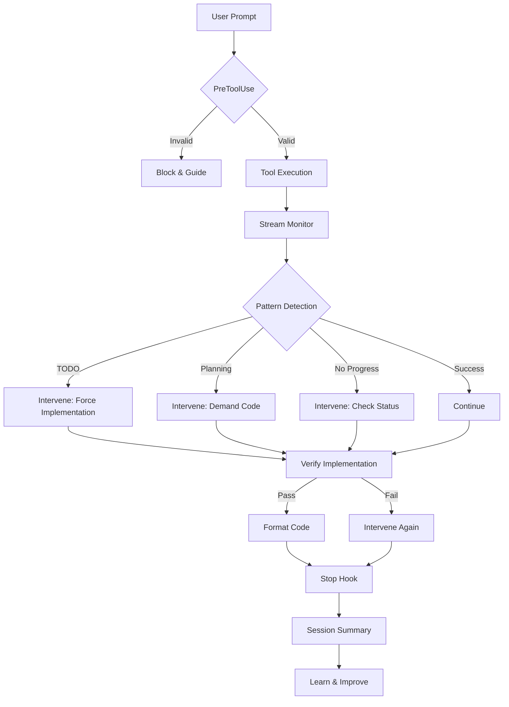

# Axiom MCP Hooks Integration - Complete Implementation Plan

## Overview

This document provides the complete integration plan for Claude Code hooks with Axiom MCP v3. The hooks transform Axiom from a passive tool into an active execution guardian that enforces implementation, enables real-time observation, and provides intelligent intervention.

## Quick Start

```bash
# 1. Navigate to hooks directory
cd /home/peter/nova-mcp/axiom-mcp/hooks

# 2. Run setup script
./setup-hooks.sh

# 3. Restart Claude Code to load hooks

# 4. Test with concrete task
axiom_mcp_spawn parentPrompt="Create auth.ts with login function"
```

## Hooks Architecture

### 1. Pre-Execution Layer (PreToolUse)
**Purpose**: Prevent problems before they start

**Scripts**:
- `axiom-validate-concrete.sh` - Ensures tasks have specific deliverables
  - Blocks research-only prompts
  - Requires file specifications
  - Forces action verbs (create, implement, build)
  - Provides clear feedback on what's needed

### 2. Real-time Observation Layer (PostToolUse)
**Purpose**: Monitor and intervene during execution

**Scripts**:
- `axiom-stream-monitor.sh` - Real-time output streaming
  - Color-coded output by type
  - Pattern detection (TODO, errors, success)
  - Progress tracking with idle detection
  - Triggers interventions automatically

- `axiom-verify-implementation.sh` - Post-execution verification
  - Checks files were actually created
  - Validates code was written (not just TODOs)
  - Tracks success/failure rates
  - Provides detailed feedback

- `axiom-format-code.sh` - Auto-formatting
  - Formats based on file type
  - Detects console.log in production
  - Counts TODOs/FIXMEs
  - Supports multiple languages

### 3. Intervention Layer (Custom)
**Purpose**: Fix problems in real-time

**Scripts**:
- `axiom-intervene.sh` - Central intervention dispatcher
  - TODO_DETECTED: Forces immediate implementation
  - PLANNING_DETECTED: Blocks planning language
  - NO_PROGRESS: Prompts for specific action
  - FILE_VERIFICATION: Ensures files exist
  - PATTERN_VIOLATION: Logs and corrects

### 4. Completion Layer (Stop/SubagentStop)
**Purpose**: Learn from execution and improve

**Scripts**:
- `axiom-finalize.sh` - Session summary and cleanup
  - Displays comprehensive statistics
  - Shows verification success rate
  - Counts interventions by type
  - Provides recommendations
  - Archives session data

## Integration Flow



## Configuration

### hooks.json Structure
Located at: `~/.claude_code/hooks.json`

```json
{
  "hooks": {
    "PreToolUse": [
      {
        "matcher": "axiom_mcp_spawn|axiom_test_v3",
        "hooks": [{
          "type": "command",
          "command": "/path/to/axiom-validate-concrete.sh"
        }]
      }
    ],
    "PostToolUse": [
      {
        "matcher": "axiom_mcp_spawn",
        "hooks": [{
          "type": "command",
          "command": "/path/to/axiom-stream-monitor.sh"
        }]
      },
      {
        "matcher": ".*",
        "hooks": [{
          "type": "command",
          "command": "/path/to/axiom-verify-implementation.sh"
        }]
      }
    ]
  }
}
```

## Metrics & Monitoring

### Real-time Indicators
- 🟢 **Green**: Successful operations, files created
- 🟡 **Yellow**: Warnings, TODOs detected
- 🔴 **Red**: Errors, planning language, failures
- 🔵 **Blue**: Information, task tracking
- 🟣 **Purple**: Interventions triggered

### Success Metrics
1. **Implementation Rate**: Target >80% (files created per task)
2. **Verification Pass Rate**: Target >75%
3. **TODO Detection**: Target <20% of outputs
4. **Intervention Effectiveness**: Target >90% correction rate

### Log Files
- `logs-v3/hooks.log` - General hook execution
- `logs-v3/interventions.log` - All interventions
- `logs-v3/verification.log` - Verification results
- `logs-v3/verification-stats.json` - Cumulative statistics
- `logs-v3/session-stats.json` - Per-session summary

## Common Scenarios

### Scenario 1: TODO Detection
```
User: "Implement user authentication"
Claude: "TODO: Add authentication logic here"
Hook: Detects TODO → Forces file creation → Blocks completion
Result: Claude must write actual authentication code
```

### Scenario 2: Planning Prevention
```
User: "Create a login component"
Claude: "I would implement this by..."
Hook: Detects planning → Shows intervention message → Demands code
Result: Claude writes LoginComponent.tsx immediately
```

### Scenario 3: Progress Stall
```
User: "Build the API endpoints"
Claude: [No output for 30 seconds]
Hook: Detects idle → Checks status → Prompts for specific file
Result: Claude states exactly what's blocking and continues
```

## Advanced Features

### 1. Pattern Learning
- Success patterns saved to `success-patterns.log`
- Violations tracked in principles database
- Rules auto-adjust based on effectiveness

### 2. Parallel Execution Support
- Stream monitors handle multiple concurrent tasks
- Each task gets unique tracking
- Best implementations identified automatically

### 3. Custom Interventions
Extend `axiom-intervene.sh` with new patterns:
```bash
MY_CUSTOM_PATTERN)
    log "Custom pattern detected"
    # Your intervention logic
    ;;
```

## Troubleshooting

### Hook Not Triggering
1. Check hook is executable: `chmod +x hook-name.sh`
2. Verify path in hooks.json is absolute
3. Check Claude Code has reloaded config
4. Review logs: `tail -f logs-v3/hooks.log`

### Too Many Interventions
1. Adjust detection thresholds in scripts
2. Refine prompt validation rules
3. Check for false positives in patterns

### Performance Issues
1. Ensure background processes are cleaned up
2. Archive old logs periodically
3. Limit concurrent stream monitors

## Future Enhancements

### Phase 1 (Immediate)
- ✅ Basic validation and monitoring
- ✅ Pattern detection and intervention
- ✅ Verification and statistics

### Phase 2 (Next Week)
- [ ] WebSocket integration for UI
- [ ] More sophisticated pattern detection
- [ ] A/B testing of interventions

### Phase 3 (Future)
- [ ] Machine learning on patterns
- [ ] Predictive intervention
- [ ] Multi-model comparison

## Conclusion

With this hooks integration, Axiom MCP v3 finally achieves its vision:
- **Observation**: See everything in real-time
- **Intervention**: Fix problems as they occur
- **Learning**: Improve based on what works
- **Enforcement**: Ensure implementation happens

The hooks close the loop between intention and execution, making Axiom MCP a true execution guardian rather than just another planning tool.

> "Now when you tell Claude to implement something, it actually implements it. Every time."